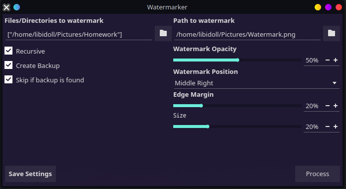

# Watermarker
Qt5 application written in Python to watermark images and videos.



## Features
- Watermark images and videos
- Set watermark opacity, position and size
- Recurse through directories to bulk watermark images and videos
- Create backups of the original files
  - Skip files for which existing backups exist
  - Or if left unchecked, it will use the backup as source to avoid double watermarking

## Usage
Install the requirements:
```bash
pip install -r requirements.txt
```

Launch the application:
```bash
python3 watermarker.py
```

For logging output, please run it in a terminal. I will add a progress bar dialog in the future.  

## Configuration
After setting your preferences you can press on "Save Settings" to save this to a file. The file is located in the application configuration directory and is called `settings.json`.  
These preferences will be loaded automatically when the application is launched.  

## Dependencies
This project uses MoviePy to watermark videos. Specifically [this fork](https://github.com/TraseeHQ/moviepy/tree/fix_rotation) on the `fix_rotation` branch. This fixes a bug where videos with rotation metadata are not rotated correctly.  

If you are having trouble with running this due to dependencies, you can use the Docker image.

### Build the Docker image
```bash
docker build . -t libidoll/watermarker:latest
```

### Run the Docker container

```bash
docker run -e DISPLAY=$DISPLAY \
  -v /tmp/.X11-unix:/tmp/.X11-unix \
  -v "XDG_CONFIG_HOME/watermarker:/root/.config/watermarker" \
  libidoll/watermarker:latest
```

You will need to add volumes for your files. For example:
```bash
docker run -e DISPLAY=$DISPLAY \
  -v /tmp/.X11-unix:/tmp/.X11-unix \
  -v "$XDG_CONFIG_HOME/watermarker:/root/.config/watermarker" \
  -v "$HOME/Pictures:/mnt/Pictures" \
  libidoll/watermarker:latest
```

## License
This project is licensed under the MIT License - see the [LICENSE](LICENSE) file for details